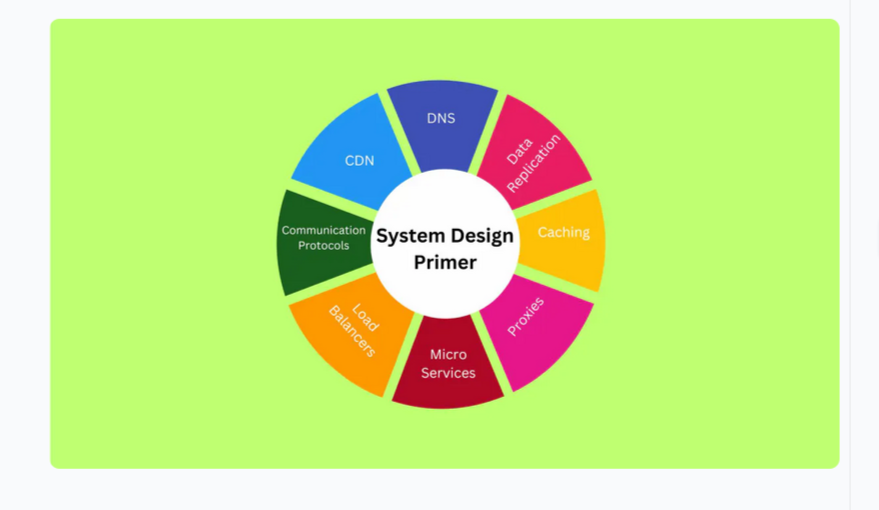
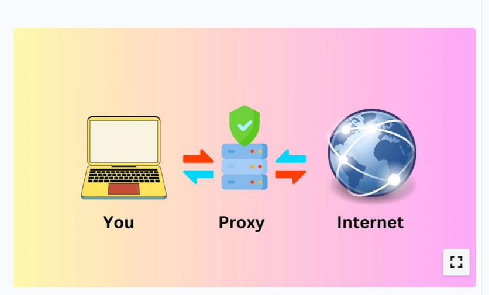

 ## Table of contents  
 [System Design Guide](#system-design-guide)
  * [The Wheel Guide](#the-wheel-guide)
  * [Understanding System Design](#understanding-system-design)
  * [Design Methods in System Design](#design-methods-in-system-design)
  * [System Design Concepts](#system-design-concepts)
  * [Advanced Concepts in System Design](#advanced-concepts-in-system-design)
  * [Components of System Design](#components-of-system-design)
  * [Approaching System Design Interview Questions](#approaching-system-design-interview-questions)
    + [Step-by-step Guide](#step-by-step-guide)
  * [Sample System Design Interview Questions and Solutions](#sample-system-design-interview-questions-and-solutions)
  * [Links and referrals](#links-and-referrals)

# System Design Guide
## The Wheel Guide  

## Understanding System Design

System design is a step-by-step process of defining a particular software's architecture, modules, components. It is a base concept in software engineering and is vital in building scalable and reliable software.

## Design Methods in System Design
1. **Architectural Design** :  

      The architectural design is the base of the system design. It describes the infrastructure, model, view, components, and interaction.
1. **Entity-Relationship Diagram(ERD Diagram)** :  

      In the ERD diagram, you can define multiple database schemas, add entities in each schema, and add multiple attributes for each entity. Also, you can connect the entities of two different schemas if a relationship exists between them.
1. **Unified Modeling Language(UML Diagram)** :  

      It contains different diagrams like activity diagrams, class diagrams, sequence diagrams, etc., to represent the different aspects of the system.
1. **Class Diagrams** :  

      The class diagrams are used to represent the classes. The class diagram can also contain the class's attributes, methods, and relationships between multiple classes. Basically, the class diagram provides an overview of the system's data and functionality.
1. **Sequence Diagrams** :  

      The sequence diagrams represent the interaction between the various components of the system. It is used to model the behavior of the system. For example, you can specify when users enter the specific input at the front end side of the application, how the application should process the data, and return the response.

## System Design Concepts

1. **Performance vs Scalability**  
      - *Performance* - Website loading times vary, with some sites like Google loading almost instantly while others take longer. Longer load times can reduce traffic as visitors prefer faster sites. Performance can be improved through mechanisms like caching, which speeds up resource delivery. Implementing such techniques is essential for retaining visitors and enhancing user experience. 

      - *Scalability* - Refers to an application's ability to handle increased demand. As popularity grows, you can manage the load by distributing it across multiple servers or boosting a single server's capacity. These strategies ensure your application can accommodate more requests effectively.
1. **Latency vs Throughput**  
      - *Latency* - The latency is a measurement of the time delay to complete a single request or data operation. The latency is mainly crucial in online or live gaming, live streaming, video calls, etc., for a seamless user experience. It is measured in the Milliseconds.  

      - *Throughput* - Is the number of operations the system can handle in a particular time or the number of data passed via network request in a given time. It is measured in megabytes (MB) per second.
1. **Consistency Patterns and Availability Patterns**  
      - *Consistency* - Ensures all nodes in a system access the same data simultaneously. If you and a friend withdraw money from the same bank account simultaneously, an inconsistent system might only record one withdrawal. Consistent systems prevent such errors by accurately reflecting all transactions.   

        *Consistency Patterns*  
        - Strong consistency guarantees that each request retrieves the latest data, necessitating synchronized communication and prioritizing data accuracy over availability.  
        - Eventual consistency permits temporary discrepancies that correct themselves over time, favoring availability over immediate consistency.  
        - Weak consistency might deliver fresh data shortly after writing, emphasizing quick access, ideal for live streaming or video chat.  

      - *Availability* - The system's availability ensures that each request receives a response either with fresh or old data. The availability is important when high uptime is needed.  

        *Availability Patterns*
        - Load Balancing: Distribute incoming requests across multiple servers to ensure high availability and manage traffic effectively.  
        - Retry and Timeout Strategies: Implement retry mechanisms to reprocess requests at intervals if the system fails or is unresponsive, similar to refreshing a webpage for a response.  

        [Click here to learn more about System Desing Concepts](https://www.designgurus.io/blog/system-design-cheat-sheet)


## Advanced Concepts in System Design
1. CDN:  
    - A CDN (Content Delivery Network) is a distributed network of servers across different locations to deliver content like images and data. By serving resources from the nearest server, it reduces latency and improves application performance. If a nearby server has cached resources, it delivers them directly; otherwise, it fetches from the origin server, caches them, and serves the users.
1. DNS:  
    - The DNS (Domain Name System) replaced the need for users to remember IP addresses by allowing access to websites via domain names. It maps domain names like [www.example.com](https://www.example.com) to corresponding IP addresses, simplifying resource retrieval. When users request resources from a domain name, the DNS returns the associated IP addresses for accessing those resources.
1. Caching:  
    - Caching, also known as high-speed storage, accelerates resource delivery by storing data between the web application and its source. When a request is made, the application first checks the cache storage; if the data is found, it's returned, otherwise, the application retrieves it from the database or source, caches it, and then serves it.
1. Proxies:  
    - The proxy, or proxy server, operates between the application's client and the internet, facilitating resource requests. When the application seeks internet resources, it communicates with the proxy server, which retrieves and returns the requested resources, often employed for caching purposes.  
    


## Components of System Design
1. **Microservices and Service Discovery:**
     - Microservices architecture involves breaking down complex applications into independent, task-specific services.  
     *The concepts below are related to the microservices.*  
        - Service Identification: Every microservice has a unique ID and name for its identification.  
        - Dynamic Service Discovery: Each microservice can dynamically find other services located in the same network. So, scaling and load balancing become easy.
1. **Database Systems: RDBMS and NoSQL:**
      - There are two primary categories of the database: RDBMS and NoSQL.
      *Relational Batabase Management System(RDBMS):-*  
        - It stores the data in the table format.  
        - You can’t scale the RDBMS database horizontally, but you can scale it vertically.
        - SQL is a query language for the RDBMS databases.
        - Accessing data from the RDBMS database is slow.  
      
        *NoSQL:-*
        - It stores the data in the key-value pair format.
        - NoSQL database is horizontally scalable, as you can add new key-value pairs for new attributes.
        - Each record can contain different key-value pairs.
        - It is faster than RDBMS databases.
        - It supports frequent changes in the database.
1. **Communication Protocols:**  
      - *HTTP/HTTPS*: HTTP stands for Hypertext Transfer Protocol, with HTTPS being its secure version. Both are used for web-based communication, and it's recommended to always use HTTPS for enhanced security.  
      - *TCP/IP*: TCP stands for Transmission Control Protocol, which is used for internet communication, such as in chat applications.  
      - *UDP*: UDP stands for User Datagram Protocol, primarily used for applications like live streaming and video calls where some data loss is acceptable.  
      - *WebSockets*: WebSockets enable bi-directional, duplex communication, establishing connections between two web applications.  

## Approaching System Design Interview Questions  
### Step-by-step Guide

1. **Requirements clarification:**  
    - Function requirements: The functional requirements are the requirements in the application with which the user interacts. For example, authentication, navigation, payment services integration.  
    - Non-function requirements: The non-functional requirements are the requirements to improve the application's capabilities. For example, high availability, scalability, consistency, low latency, high throughput.  
1. **Estimation of resources:**  
    -  Deciding what kind of resources you should use to build the application.
1. **System interface definition:**  
    - designing the system interface. For example, defining the API endpoints and what to expect from each API endpoint.
    ``` API
    sendNotification(userId, message, …);
    ```
1. **Defining Data model:**  
    - If you need to store the structured data and tables are pre-determined, you can use the relational database. For storing the unstructured data, you should use NoSQL databases like MongoDB.
1. **High-level design:**  
    - Decide how you will connect the components of the system with each other. For example, connecting the server with the dAt last, you should identify the bottlenecks in your system design and discuss the solutions to resolve them with the intervieweratabase, connecting the server with the client
1. **Detailed design:**  
    - You need to analyze the system to fulfill the non-functional requirements.
1. **Identifying and resolving bottlenecks:**  
    - At last, you should identify the bottlenecks in your system design and discuss the solutions to resolve them with the interviewer

## Sample System Design Interview Questions and Solutions
1. **How would you design a URL Shortening service similar to TinyURL?**  
    
    *Requirements clarification:*

      - When you give a long URL as an input, it should return the shortened URL.  
      - When you click the shortened URL, it should redirect to the original URL.  
      - Consider 500 requests per second, and make scalable accordingly.  
      - Delete the expired URLs.  
      - Track the number of clicks on the URL.  

      *Approach:*  

      - Utilize REST APIs for server communication and handle 500 requests per second with load balancing techniques.  
      - Implement a relational database for storing and mapping long URLs to short URLs, which does not require horizontal scaling.  
      - Generate unique IDs for each shortened URL to ensure efficient and reliable URL shortening.

1. **How would you design a Web Crawler?**  
 *Approach:*  
   - You can discuss how to open multiple web pages in a web browser and determine the optimal number of browser windows to open simultaneously for efficient crawling. Opening too many windows, such as 1000 at once, can exhaust the device's memory.

1. **How would you design Facebook and Instagram?**  

*Requirements:*
  - User signup/sign-in with authentication.  
  - Features for publishing posts and short videos.  
  - Followers and following functionality with direct messaging.  
  - Displaying latest posts from followers and trending posts in the feed.

*Approach:*  
  - Handle user relationships and data in the database, including database replication for failure management and caching for performance.  
  - Implement authentication and chat features, potentially integrating third-party applications for messaging.  
  - Use algorithms to display trending or latest posts in the feed.  
  - Ensure efficient load balancing to manage user interactions and post publishing.  

## Links and referrals
1. [System Design Interview Roadmap](https://www.designgurus.io/path/system-design-interview-playbook)  
1. [System Design Interview Survival Guide](https://levelup.gitconnected.com/system-design-interview-survival-guide-2023-preparation-strategies-and-practical-tips-ba9314e6b9e3)
1. [The Complete Guide to Ace the System Design Interview](https://www.designgurus.io/blog/complete-guide-sys-design)
1. [Ace Your System Design Interview with 7 Must-Read Papers](https://www.designgurus.io/blog/sys-design-papers)